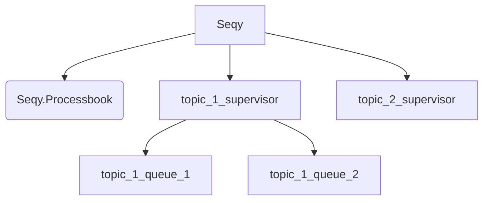

# Seqy

Seqy is an events sequentializer. Need to process events in a specific order? Seqy can help.

## Under Seqy's Hood



When `Seqy` is started, it also starts `Seqy.Processbook` and a supervisor for each sequence topic configured.

`Seqy.Processbook` is responsible for storing the `pid` of the process that would handle the processing of a specific event queue.
Once you enqueue an event, `Seqy` would check in the processbook if there's an active handler for the specific `queue_id`.
If there's none, `Seqy` would start an instance of the handler under the corresponding topic supervisor. When all the events are
exhausted, the handler for the specific queue would terminate.


## Installation

Add `seqy` as a dependency on your `mix.exs` file.

```elixir
def deps do
  [
    {:seqy, "~> 0.1.0"}
  ]
end
```

## Configuration

To make Seqy work, you need to define the topic, events and handler module.

```elixir
config :seqy,
  topics: [
    %{
      name: :user_purchase,
      actions: [:"user.created", :"user.purchased", :"user.paid"],
      handler: MyApp.EventHandler
    }
  ]
```

`actions` should have the desired order for processing the events.

## Usage

Before enqueueing events with Seqy, you need to define a handler for the topic.
To define a handler, create a module that `use` the `Seqy.Handler` module. Then,
implement the `handle/1` callback for each event you expect in the sequence.

```elixir
defmodule MyApp.EventHandler do
  use Seqy.Handler

  require Logger

  def handle(%Seqy.Event{action: :"user.created", args: %{user_id: user_id}}) do
    Logger.info("#{user_id} has been created.")
  end

  def handle(%Seqy.Event{action: :"user.purchased", args: %{user_id: user_id}}) do
    Logger.info("#{user_id} has purchased an item.")
  end

  def handle(%Seqy.Event{action: :"user.paid", args: %{user_id: user_id}}) do
    Logger.info("#{user_id} has paid.")
  end
end
```

With the event handler ready, we can start enqueueing events to Seqy.

```elixir
%{action: :"user.created", queue_id: "user_id:1", topic: :user_purchase, args: %{user_id: 1}}
|> Seqy.new()
|> Seqy.enqueue()
```

An event should have the ff:

  - `action` - event action that would be used for ordering
  - `queue_id` - this would be used as the routing key
  - `topic` - topic of the sequence you declared in your config
  - `args` - event payload

